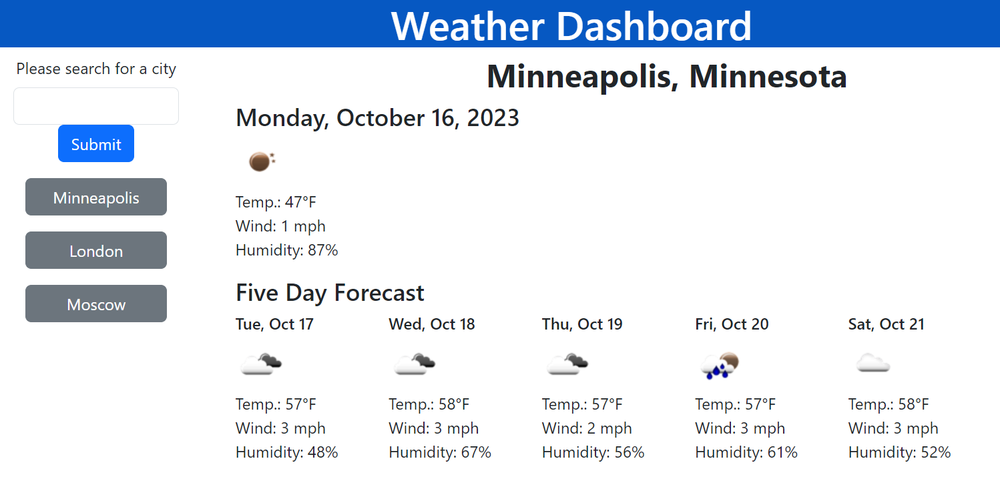

# 06 Server-Side APIs: Weather Dashboard

## User Story

```
AS A traveler
I WANT to see the weather outlook for multiple cities
SO THAT I can plan a trip accordingly
```

## Acceptance Criteria

```
GIVEN a weather dashboard with form inputs
WHEN I search for a city
THEN I am presented with current and future conditions for that city and that city is added to the search history
WHEN I view current weather conditions for that city
THEN I am presented with the city name, the date, an icon representation of weather conditions, the temperature, the humidity, and the wind speed
WHEN I view future weather conditions for that city
THEN I am presented with a 5-day forecast that displays the date, an icon representation of weather conditions, the temperature, the wind speed, and the humidity
WHEN I click on a city in the search history
THEN I am again presented with current and future conditions for that city
```

## Example

The following image shows the web application's appearance and functionality:



The repo can be found at: https://github.com/Shagomir/weather-forecast-tracker/deployments

The application is available at: https://shagomir.github.io/weather-forecast-tracker/

## Developer Commentary

This application will take a search string and return the current weather at that location, as well as the next 5 days forecast. 

We have two API calls that are linked, one to get the geolocation data, then a second to get the actual weather information. These are only called if you search for a city. If the city exists and can be found, it will display the data and save the geolocation data to local storage. 

If you click on any of the buttons to return to a saved forecast location, it will use the stored geolocation data and only call the weather api. 

I would like to add a modal for when more than one option is returned, but that is outside the scope of the initial project - I will probably come back at some point to do that. 


